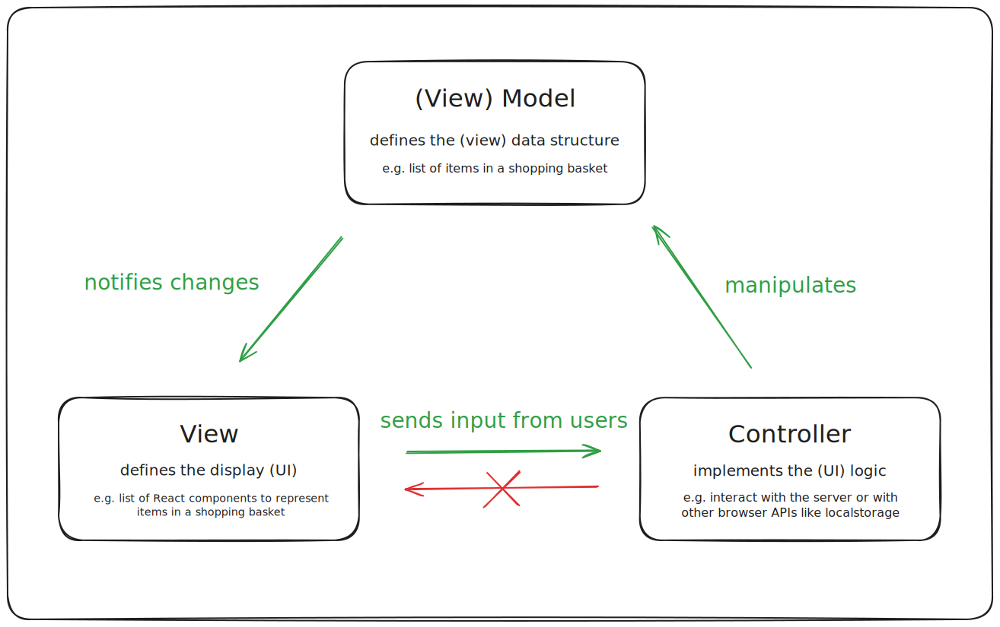
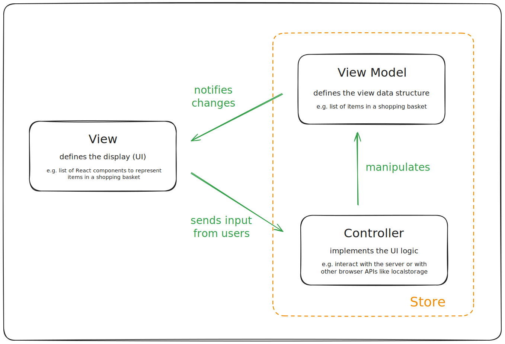

# Introduction

This tutorial is going to drive through all mom features. It is split in 2 parts:

1. **Fundamentals** that cover most of the mom's APIs and base concepts
2. **Techniques** that present examples on how mom can be used to solve frequent use cases that arise in UI development (e.g. dialogs, internationalization, logging, forms...)

The goal of the tutorial is to let you know **how** to use mom - but also **why** mom is built this way.

The tutorial is meant to address a large audience, from beginners in UI development to seasoned developers. The only requirement is to be familiar with Typescript.

Note: The more advanced parts are covered in **advanced sections** that can be skippped and kept for further reading (this is where the _why_ part of things are usually covered).

## Why using stores?

If you already worked in large code bases you may already be convinced of the concept - unless you also had a bad experience with some store technologies and you are not so sure any more?
In any case, the goal of mom is to make stores simple and efficient - so hopefully you will be convinced at the end of this tutorial!

Technically stores are connected to the [Model-View-Controller][MVC] (MVC) that is at the core of all modern UI frameworks (cf. [Todo MVC][TodoMVC] examples). Like for any [design patterns][DesignPatterns], one of the goal of the MVC pattern is to bring a clear structure to your code. This will prove essential on large code bases maintained by multiple developers over time as it ensures better readability and maintainability. In a more general manner design patterns tell you **where some specific code should be written** - but more importantly **where a specific piece of code should be found** (when you don't know the code base).

Technically the MVC pattern recommends to split the UI code in 3 different parts

-   The **Model** (or View model in our case) that basically represents the UI as a data structure (usually a treee). For example if the UI can disable a button, then the Model should expose a _buttonDisabled_ boolean data - and this data will be interpreted by the View layer to actually enable or disable the button (so the View should only _map_ the data to the actual [DOM] elements)
-   The **View**, that reads the model data and creates or udpates the visual elements to represent it on the screen. In the mom's case, this is handled by [React] (or preact) components. Note: the view must be able to react to model changes (this where [mobx][Mobx] comes into play) and must also forward user events (e.g. when a button is clicked) to the the Controller part:
-   The **Controller** layer that handles the UI logic. It usually exposes function endpoints (aka. _actions_) that will be mapped by the View on [DOM] events (the button onClick) and that will perform some application-specific logic. The logic may involve external operations (e.g. fetching data from the server) and will eventually result in updates of the Model data structure. These updates will automatically trigger View updates, and so on...

The following diagram (adapated from [MDN][MDNMVC]) shows the MVC pattern on UI modules:

The green arrows show the [Unidirectional Data Flow][UDF] pattern mentioned in the mom main page: changes flow from the controller to the Model and then to the View. Controller must not access the View and Views must not change the Model. All modern frameworks have adopted this pattern as it allows to support reactive technologies (cf. Reactive section in this tutorial).

Having said that, and to come back to the intial question: Stores correspond to the Model+Controller parts of the MVC pattern. Using explicit stores on top of React simply consists in **removing all logic from the React components** in order to ease maintainability and testability:

[TodoMVC]: https://todomvc.com/
[MVC]: https://developer.mozilla.org/en-US/docs/Glossary/MVC
[React]: https://react.dev/
[Mobx]: https://mobx.js.org/
[DesignPatterns]: https://en.wikipedia.org/wiki/Software_design_pattern
[DOM]: https://developer.mozilla.org/en-US/docs/Web/API/Document_Object_Model/Introduction
[MDNMVC]: https://developer.mozilla.org/en-US/docs/Glossary/MVC
[UDF]: https://dev.to/aryclenio/unidirectional-and-bidirectional-data-flow-the-ultimate-front-end-interview-questions-guide-pt-1-5cnc

## Benefits

-   Much simpler, less cluttered React components (no states, very few hooks) with only _mappping_ logic
-   Drastic reduction of props in the React components: most components only have one or two props (i.e. a reference to the store and a _className_ prop).
-   Possibility to have multiple React components for one store
-   Easy React component refactoring: React components can be easily split into multipe components when required (this is more complicated when the component is using state hooks)
-   Most of the regression tests can be done with jest/vitest tests with no need for DOM emulation as the all the logic lies in the Controllers. As such, tests are simpler to write, faster to execute, and easier to maintain. This usually results in a better test coverage because tests development is much less painful.
-   Easier management of complex logic (everything is in plain Typescript in the Controller)

On top of that mom adds the following extras:

-   Easier management of large code base (HVMC)
-   Easier management of asynchronous initialization (cf. next)
-   AI friendly approach as code is very normative (mom)

To be transparent, this comes at the cost of a more slightly verbose code base - but as we will see, this can be easily overcome with tooling, AI helpers or code snippets.
