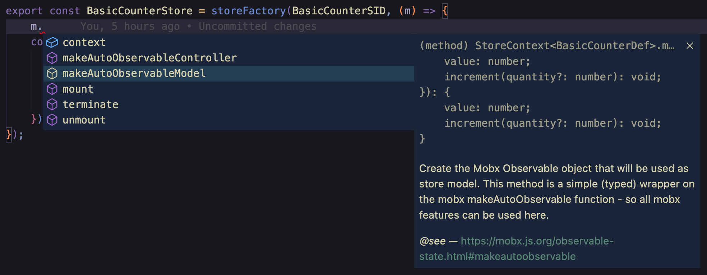
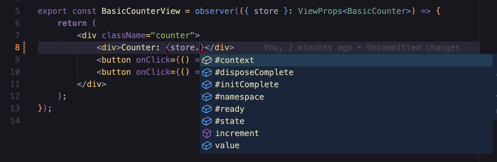

# Basic store: interface & factory

The simplest example that we can think of is probably the _Counter_ use case: a small module that displays a numeric value with 2 buttons (_increment_ and _decrement_) to change the counter value.

> Note: for lack of better words, this tutorial uses the term _module_ for the set of elements that composes an MVC _module_ (i.e. the store + the view). The term _component_ is only used to refer to the React _components_ (to avoid any confusion).

By convention, a mom module is usually composed of at least 4 files:

-   a _types_ file that exposes the module API (i.e. the public model and controller APIs) and that contains the typescript type declarations
-   an implementation file that contains the module code
-   a _view_ file that contains the module's React components (there may be several) - note: it is also frequent to have multiple view files for large modules (e.g. _mymodule.main.view.tsx_, _mymodule.header.view.tsx_, _mymodule.footer.view.tsx_, etc.)
-   a _spec_ file that contains the module tests

All those files should be grouped in the same _module folder_, with the module name (i.e. _basicCounter_ in this example)

```
basicCounter
|_ basicCounter.spec.ts
|_ basicCounter.ts
|_ basicCounter.types.ts
|_ basicCounter.view.tsx

```

## Store Types

A module implementation usually starts with the _types_ file that defines the module's public APIs. In the case of the _basicCounter_ module, this file looks like this:

<!-- start:code src="src/examples/basicCounter/basicCounter.types.ts" -->

```typescript
import { Store, storeIId } from "@/mom.types";

/** BasicCounter API Definition */
type BasicCounterDef = {
    model: {
        /** The counter value - default: 1 */
        value: number;
        /** Increment the counter by the given quantity (can be negative) - default: 1 */
        increment(quantity?: number): void;
    };
};

export type BasicCounterStore = Store<BasicCounterDef>;
export const BasicCounterSID = storeIId<BasicCounterDef>("mom.examples.basicCounter");
```

<!-- end:code -->

This file contains 3 entities:

-   the main **store definition** (i.e. _BasicCounterDef_) that defines the public store APIs. This definition is composed of 2 parts:
    -   a **model** part, that defines the data (e.g. **value**) and actions (e.g. **increment**) that will be exposed to the view and to the parent stores
    -   a **params** part (not used in the example) that defines the parameters that can be used to instantitate the store (this will be demonstrated in a later example).
-   the **store public API** (i.e. _BasicCounter_) that is automatically derived from the store definition and that corresponds to the model type that will be visible by the store users
    (i.e. the view and the parent stores - cf. auto-completion screenshots below). Technically this type is composed of the union of 2 types:
    -   the store model defined in the store definition
    -   generic metadata that are automatically managed by mom (cf. intellisense screenshot below). The names of those metadata always start with the "#" character to avoid
        any collision (e.g. _#namespace_ that contains the store namespace)
-   the **Store Interface Id** (SID) that is used to bind a unique (store) namespace (here _mom.examples.basicCounter_) to the store defintion type (here _BasicCounterDef_).
    This Store id is technically optional but is key to several features, so it is better to use it systematically (as you can see, this can be easily generated).

## Store Implementation

As the goal of mom is to create a tree of micro-stores that may contain several instances of the same store type, the implementation file actually consists in exposing a **store factory** function that will be called by mom to generate **store instances**. The store factory function takes 2 parameters:

-   the store id (SID) defined in the types file
-   an implementation function that receives a typed helper (the **m** parameter) used to create the store internal objects (note: it also takes a second _params_ argument that is not used in this example but that we will see in the next chapter)

<!-- start:code src="src/examples/basicCounter/basicCounter.ts" -->

```typescript
import { storeFactory } from "@/mom";
import { BasicCounterSID } from "./basicCounter.types";

export const BasicCounter = storeFactory(BasicCounterSID, (m) => {
    const model = m.makeAutoObservableModel({
        value: 1,
        increment(quantity = 1) {
            model.value += quantity;
        },
    });
});
```

<!-- end:code -->

In this particularly simple case the implementation function only needs to create a simple _mobx_ object through the _makeAutoObservableModel_ function that is
a typed wrapper over the mobx [makeAutoObservable] function (basically mobx will make this object _observable_ so that for instance the view that uses it gets automatically refreshed in case of changes - more on this in the reactivity chapter). Mom will simply add extra metadata to this object that will then be returned by the factory function (as we
will see later on the metadata expose key information on the **store life cycle**).

Note: the typing is possible thanks to the SID parameter which allows to get automatic type support for all entities in the factory implementation function, as we can see in this auto-completion screenshot:


[makeAutoObservable]: https://mobx.js.org/observable-state.html#makeautoobservable

## View

The last file to be expected is of course the React component that will use the store instance as main prop:

<!-- start:code src="src/examples/basicCounter/basicCounter.view.tsx" -->

```typescript
import { observer } from "mobx-react-lite";
import { BasicCounter } from "./basicCounter.types";
import { ViewProps } from "@/mom.types";

export const BasicCounterView = observer(({ store, className }: ViewProps<BasicCounterStore>) => {
    return (
        <div className={className}>
            <div>Counter: {store.value}</div>
            <button onClick={() => store.increment(1)}>Increment</button>
            <button onClick={() => store.increment(-1)}>Decrement</button>
        </div>
    );
});
```

<!-- end:code -->

As the store is a mobx observable object, the react component needs to be wrappped with the mobx [observer] function that will ensure that the component is automatically
re-rendered when needed (here when _store.value_ changes). Note: mobx is smart enough to only refresh the component when needed (e.g. if an unused property is changed, the view won't get
refreshsed - this will be explained in a later chapter).

Here again the store view props will be fully typed:



[observer]: https://mobx.js.org/react-integration.html

## Loading the module in an existing react component

In order to load a mom module inside an existing React component, we need to instantiate the module store as a _root_ store, as this store will not be attached to any parent store
(as we will see later on, displaying a child store is even more simple).

This is done through the mom **createStore** function that takes only one _params_ argument that contains the store initialization params (we didn't define any for BasicCounter)
with an extra **$store** property that references the store factory.

As the store must be no be re-generated across refreshes, we need to persist it through a react _useState_ hook:

<!-- start:code src="src/examples/basicCounter/basicCounter.example.tsx" -->

```tsx
import { createStore } from "@/mom";
import { BasicCounterStore } from "./basicCounter";
import { BasicCounterView } from "./basicCounter.view";
import { useState } from "react";

export const HelloBasicCounter = () => {
    const [store] = useState(() => createStore({ $store: BasicCounter }));
    return (
        <div>
            Basic Counter: <BasicCounterView store={store} />
        </div>
    );
};
```

<!-- end:code -->

Note: root store created with **createStore** can be disposed with the **disposeStore** function:

```typescript
disposeStore(store);
```

## Advanced: why a separate file for types?

You may wonder why mom enforces a separate file to define the store types as it may seem a bit too verbose?

Actually this is done for 2 reasons:

-   first, when dealing with real-life stores, the types file proves very handy to quickly grasp what a store is doing without having to dig into the store
    implementation - this may be a bit verbose for very simple cases, but it is a time saver for complex stores.
-   second, the types must be in separate files to support progressive application load: if a store A references a sub-store B, the store A must not _import_
    the store B implementation, otherwise loading the store A would automatically load the code of the store B (and transitively all the application code base!). This is why
    store dependencies must only be done through type files (that will be discarded when typescript is transpiled to javascript - only the SID token will remain).
