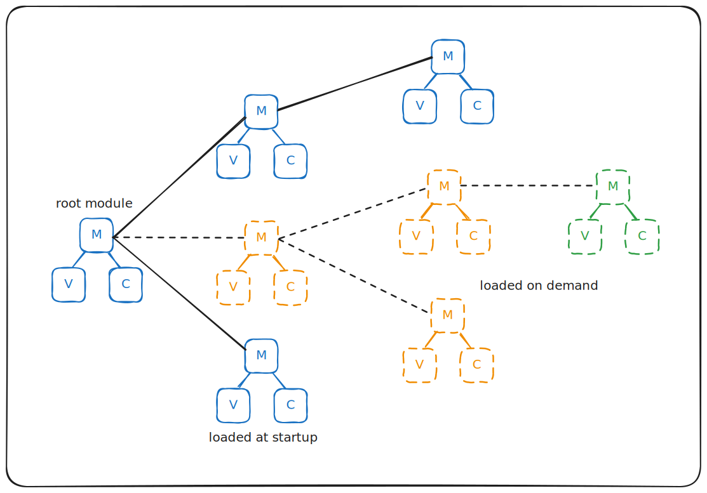

# The HMVC pattern

When using MVC modules in real-life applications, we quickly get to the point where they get very large and hard to maintain.
The natural evolution is then to try to split these modules in smaller modules and organize them, usually as a tree (aka. hiearachy) - this is basically the idea of the [Hiearchical Model-View-Controller][HMVC] pattern.

When getting into the details we quickly face 2 questions:

-   how should we connect the MVC modules?
-   what should be a module granularity?

## Connecting the MVC modules

The first attempt in connecting MVC modules usually consists in creating links through their controllers.
In practice this approach proves a bit unwieldy as we have to frequently traverse those "inter-module" links when navigating the global model. This is why **mom's approach is to connect the MVC micro-modules throught their models**.

This allows to build a nice global application model (that can be a tree or a [DAG]) as illustrated in this example:

Of course we don't want to load the entire application at startup, but only was is required to fulfill the first user request. This is why in practice **most sub-model references have to be nullable** (and null by default), as shown in the next chapter.

[HMVC]: https://en.wikipedia.org/wiki/Hierarchical_model%E2%80%93view%E2%80%93controller
[DAG]: https://en.wikipedia.org/wiki/Directed_acyclic_graph

## Module granularity

When a module store reaches serveral hundred lines of code, it seems quite obvious that it is getting too big. But how small should a store be?

After several years of practice, mom was designed with the conviction that it is not a problem to have very small stores as long as they are part of a bigger store model (through the store hiearchy) - and this is actually was lead to mom's creation.

For instance:

-   some stores can be as small as one store per _input field_ (usually as child store of a bigger _form_ store). This allows to delegate some validation / behaviour logic to the _input_ stores while keeping the global validation / coordination logic in the _form_ store (cf. form chapter).
-   most stores are of average complexity and usually manage several state values and sub-stores.

Note: the store models are accessible to the store views but also to the parent stores - and **it is frequent to have logic in parent stores that coordinates several sub-store action calls** (this is something that cannot be done with React components and is one of the great strength of the HMVC approach).
