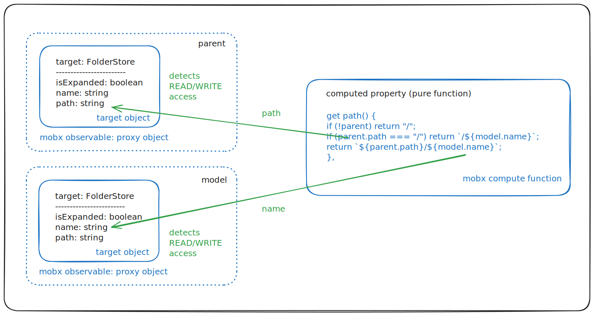

# Reactivity

As stated in mom's introduction, mom is a thin layer on top of Mobx and React to bring HMVC modules organization. Mom doesn't try to hide mobx, this is why you need to understand mobx reactivity to use mom.

## What is reactivity?

To quote [wikipedia][WRP], "reactive programming is a declarative programming paradigm concerned with data streams and the propagation of change".

To say it differently, reactive programming is a way to design and code data dependencies, so that changes in data sources can be automatically propagated to _computed_ data (as an example, a mobx computed property is a computed data). Reactive frameworks (like [RxJS], [mobx] or [zustand]) are all based on 2 fundamental principles:

-   _observable_ data need to be written in a way so that data READ and WRITE operations can be detected (observable is used in a generic term here - i.e. data that can be used in a reactive process).
-   the frameworks support a way to write _compute_ functions that can react to observable data changes (i.e. they will be automatically called in case of data change). Those functions need a way to _subscribe_ to change events on the data they use as input in order to be automatically reprocessed when a change occurs. Note: the output of these functions can either be other observable data (this will create a chain reaction) or anything else (in which case they would correspond to what is usully called an _effect_).

Mobx solves those 2 requirements in a very elegant way:

-   observable data are implemented through JavaScript [Proxy] objects that transparently wrap a _target_ object and that can automatically detect any READ or WRITE access to this target object. Mobx offers several ways to create those proxy objects - but the one mostly used in mom is the [makeAutoObservable] function that was already presented in this tutorial.
-   compute functions are normal functions wrapped by mobx reactive processors (e.g. through a computed getter or through functions like [autorun], [reaction] or [observer]). To keep things simple, mobx doesn't require to explicitely declare the observable inputs that are used by compute functions as it will detect them automatically: when entering a compute function mobx detects the observable data that get accessed by this function and automatically subscribes to change events for these particular dependencies. Of course the dependency list is dynamic and is reprocessed at each run: for instance dependencies may differ when executing different control flow statements (e.g. _if_ or _for loop_ blocks). The corollary is that those compute functions
    -   should not depend on non-observable data - or if they do (like by accessing a global configuration object), you have to understand that they won't be automatically reprocessed
    -   they should produce the same output for a given input (e.g. they cannot use random values)
    -   they must not change the observable properties they read.

[WRP]: https://en.wikipedia.org/wiki/Reactive_programming
[RxJS]: https://rxjs.dev/
[mobx]: https://mobx.js.org/
[zustand]: https://zustand-demo.pmnd.rs/
[Proxy]: https://developer.mozilla.org/en-US/docs/Web/JavaScript/Reference/Global_Objects/Proxy
[makeAutoObservable]: https://mobx.js.org/observable-state.html#makeautoobservable
[reaction]: https://mobx.js.org/reactions.html#reaction
[autorun]: https://mobx.js.org/reactions.html#autorun
[reaction]: https://mobx.js.org/reactions.html#reaction
[observer]: https://mobx.js.org/react-integration.html

## Reactivity with Mobx: computed properties

Let's come back to the _FolderStore_ example presented in the previous chapter. In this example we had a _path_ computed
property that was calculated from 2 properties (_path_ and _name_) from 2 different observable objects (_parent_ and _model_):



When computing the _path_ property (i.e. on _read_), mobx will automatically detect the dependencies:

-   if _parent_ is null, it will not detect any dependency (as null is not an observable) and the computed property will never be reprocessed (this is not a problem here as parent is a param and cannot be changed).
-   if _parent_ is not null, mobx will detect dependencies on _parent.path_ and _model.name_ - so if one of these values changes, the computed property will be automatically re-processed. Note: if other properties are changed (like _parent.name_ or _model.isExpanded_) the computed property will not be re-processed. Note also that if _parent_ or _model_ are changed to point to other objects the computed property will not be re-processed either as the dependency is attached to the observable instances that were used during the last computation.

As we can see in this example, the path computed property recursively relies on another _path_ computed property (the parent path) - so we transparently created a chain reaction in this case.

## React observers

The main use case for reactivity in an MVC environment is the **capacity for the View to automatically get refreshed when the Model changes** - and this is exactly what the Mobx [observer] function does: basically it is the equivalent of a computed property processor, except that it doesn't compute a value that will be re-exposed, but simply produces an _effect_ (i.e. the HTML DOM update, through the React engine).

For instance, if we consider the following component:

```typescript
export const CounterView = observer(({ store, className }: ViewProps<CounterStore>) => {
    return (
        <div className={className}>
            <div>Counter: {store.formattedValue}</div>
            <button onClick={() => store.increment(1)}>Increment</button>
            <button onClick={() => store.increment(-1)}>Decrement</button>
            <button onClick={() => store.reset()}>Reset</button>
        </div>
    );
});
```

This component will automatically get refreshed if one of those value changes:

-   _store.formattedValue_
-   _store.increment_ (technically the function could be changed by another function, even though this is not recommended)
-   _store.reset_ (same)

But more importantly:

-   **the component will NOT be refreshed if any other store property changes** (e.g. store.foobar or store["#ready"])
-   **the component that contains this component will NOT be refreshed** - this is very important as it allows to update child components in very large component tree without any performance impact, as only the components with changed dependencies will be refreshed.

## Autorun

If you need to perform some effects in the store scope - i.e. like _observer()_ but outside a React component - then mobx exposes the [autorun] function that does exactly that: it behaves like [observer] but for any JavaScript function.

That being said, compute functions like autorun create internal subscribers that need to be garbage collected when the store gets disposed. This can be done manually by storing the _disposer_ function returned by _autorun_ and calling it in the store dispose:

```typescript
// extract from mobx documentation
const counter = observable({ count: 0 });

// Sets up the autorun and prints 0.
const disposer = autorun(() => {
    console.log(counter.count);
});
// ...
// Stops the autorun.
disposer();
```

To remove this hassle, mom exposes an autorun wrapper that does that automatically (the _disposer_ returned by autorun() is kept in
the background and disposed with the store):

```typescript
// will be automatically disposed
m.autorun(() => {
    console.log(counter.count);
});
```

Notes:

-   if you intend to compute observable values from other observable values, you should favor computed properties or _reactions_ (cf. below) instead of _autorun_.
-   a very common use case for autorun is the implementation of _onChange_ event handlers that are usually defined as store params:

```typescript
m.autorun(() => {
    params.onChange?.(model.value);
});
```

## Reactions

If you need to perform finer grained changes and potentially trigger chain reactions, then you can use the mobx _[reaction]_ function.

The _reaction_ function works like autorun, but instead of only having one effect function argument, it needs to be provided with 2 function arguments:

-   the first function processes the READ part of the reaction and returns an input value that will be passed to the second _effect_ function (this return value can be an objects with multiple values). This function finds out (and subscribes to) the reaction dependencies.
-   while the second _effect_ function is meant to process the WRITE part of the reaction (like for instance update other observable values). Note: observable values read in the effect function will not trigger new observable subscriptions, so this part must be really limited to WRITE operations.

Like for _autorun_, mom provides a simple _m.reaction_ wrapper to ensure garbage collection and pre-defined default options. Here is an example of reactions in a simple test store (in this example, computed values would have been a better choice, but this allows to demonstrate the reaction):

<!-- start:code src="src/tests/reactions.spec.ts#reaction" -->

```typescript
const ReactionTest = storeFactory<TestDef>((m) => {
    const model = m.makeAutoObservableModel({
        value: "initial value",
        msg1: "",
        msg2: "",

        setValue(v: string) {
            model.value = "BEFORE"; // no effect as the setter in an action
            model.value = v;
        },
    });

    // reaction: (model.value) => model.msg1 (equivalent to a computed prop in this case)
    m.reaction(
        () => {
            if (model.value === "A") {
                return "Value is A";
            }
            return "Value is not A";
        },
        (v) => {
            model.msg1 = v;
        },
    );

    // reaction: (model.value, model.msg1) -> model.msg2 (equivalent to a computed prop in this case)
    m.reaction(
        () => ({ v1: model.value, v2: model.msg1 }),
        (data) => {
            model.msg2 = `${data.v1}: ${data.v2}`;
        },
    );
});
```

<!-- end:code -->

Notes:

-   _m.reaction_ (and _m.autorun_) must be called after _m.makeAutoObservableModel_ as otherwise the _m.store_ property isn't defined yet
-   you have to **be cautious to not create dependency loops while using reactions** (e.g. if A is computed from B that is computed from C that is computed from A) - to avoid this pitfall, a good practice is to write reactions one after each other and never update observables that have been used before - e.g.:
    -   (A, B) => C and D (A, B, C... are used to represent observable data)
    -   (A, D) => E
    -   (E, D, B) => F and G

## Advanced notes

-   mom sets default _name_ and _onError_ autorun options (the 2nd optional argument of the autorun function) so that errors are automatically reported through the mom logger (cf. next chapters) with the store #id.
-   like for _autorun_, mom also sets default values to the reaction options (the 3rd argument of the reaction function, not shown in this examples): on top of the _name_ and _onError_ properties that are changed to get automatic error logging, mom also sets the _fireImmediately_ value to true, so that _m.reaction()_ behaves similarly to the _m.autorun()_ (and computed property) functions.
