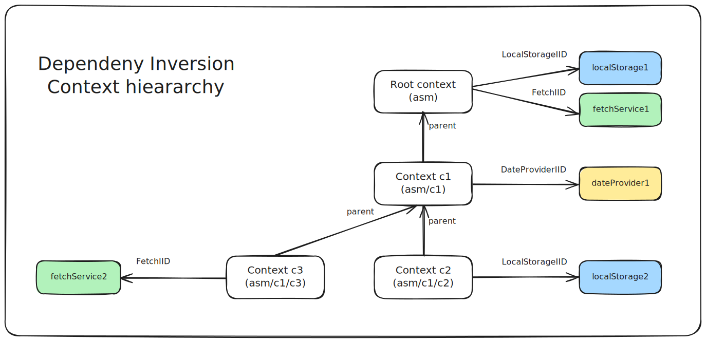

# Dependency Inversion Context

Testing frontend projects is (rightfully) considered very difficult as on the one hand the frontend output is done through the browser DOM (and this requires a special test environment) and on the other hand its code relies on many different browser APIs and (sometimes complex) user inputs.

Mom tackles those issues in two ways:

-   the HMVC architecture allows to shrink to the minimum the part of the code that interacts with the DOM (i.e. the React View) by extracting all the sensitive parts (i.e. the logic) into the Models and the Controllers (the stores), thus reducing the need for extensive test coverage of the Views (cf. test chapter)
-   mom relies on a generic [Dependency Inversion][DInv] library ([asimo]) to manage (and simulate) code dependencies (e.g. access to the browser _localStorage_, to the _fetch_ API, etc.)

The principle of Dependency Inversion (also known as _Inversion of Control_ or [IoC]) can be simply summarized as **"Code should rely on interfaces, not implementations"** in order to offer more fine-grained testing possibilities and easier refactoring.

Technically it means that the code should only import external dependency interfaces (and not their implementation) and will rely on an external mechanism to retrieve (or be fed with) the actual implementation. The most common implementations of IoC usually relie on _Dependency Injection_ that basically _injects_ the dependencies in the object (usually in the constructor) at object creation time. The problem with this approach is that it requires dependencies to be loaded prior to the object creation - this is why Dependency Injection is not well adapted to client-side code as the client code base needs to be loaded progressively (e.g. if a feature is rarely used its code should not be loaded on the very first page, but only when needed).

This is why mom relies on the [asimo] library to manage IoC. This small library simply allows to _retrieve_ dependencies on-demand (dependencies are not injected). As the retrieval is done asynchronously, asimo can also load the depedency code on-demand (i.e. on first retrieval).

[asimo]: https://github.com/asimojs/asimo/
[IoC]: https://en.wikipedia.org/wiki/Inversion_of_control
[DInv]: https://en.wikipedia.org/wiki/Dependency_inversion_principle

## IoC containers (contexts)

In practice, IoC solutions relie on containter objects that basically act as dictionaries for dependencies: they associate a dependency identifier to a dependency object (or its factory as explained below) through an internal Map. In asimo the dependency identifier is a token that binds a unique string ID (built as a namespace) to a type (in order to get the right type when fetching the dependency) - this is basically the Store Interface ID tokens (IID) that are used in the mom store factories (cf. previous chapters); as we will see later on, these IID tokens allow to load the mom store code asynchronously.

The IoC containers are organized as a hiearchy to allow local dependency overrides, without having to redefine the full set of dependencies. As such, they offer similar possibilities as _React contexts_ - this is why mom APIs reference them as _context_ objects.



The previous diagram depicts a hiearchy of 4 IoC containers/contexts: asm, c1, c2 and c3 (_asm_ is automatically created by asimo as a root container where we can define default dependencies) with 4 interface tokens (by convention their names start with a capital letter and end with IID - i.e. InterfaceID). According to this example:

-   if we try to retrieve the _LocalStorageIID_ dependency on the c2 context (i.e. `c2.fetch(LocalStorageIID)`) we will get the _localStorage2_ instance (because it is directly attached to c2). As you can guess, the goal of the LocalStorageService would be to offer access to the browser _localStorage_ API.
-   `c2.fetch(DateProviderIID)` will return the _dateProvider1_ object (not defined on c2 but defined in its parent c1)
-   `c3.fetch(LocalStorageIID)` will return the _localStorage1_ object

So far so good, but let's see what happens if we try to retrieve a dependency that is not defined. Actually asimo provides two possibilities:

-   `asm.fetch(DateProviderIID, null)` will return _null_ (the second parameter is a default value) - but this means that the calling code will need to handle this particular case (the TypeScript return type will denote the null possibility).
-   `asm.fetch(DateProviderIID)` will throw an error: this is the most common practice as a missing dependency is often the result of a misconfiguration, so we don't necessarily want to manually handle such error everywhere (in this case the Typescript interface will not denote the null possibility).

Note: the previous context hiearchy can be created with the following [asimo] apis:

```typescript
import { asm } from "@asimojs/asimo";

const c1 = createContainer({ name: "c1", parent: asm });
const c2 = createContainer({ name: "c2", parent: c1 });
const c3 = createContainer({ name: "c3", parent: c1 });
```

## Synchronous and Asynchronous dependencies

In practice each asimo container implements 2 distinct dependency dictionaries:

-   one for dependencies that must be retrieved **asynchronously** (like store IIDs). This is the most common case, that corresponds to services or object factories that can be loaded on demand, when first requested.
-   one for dependencies that must be retrieved **synchronously** such as configuration objects.

Those 2 types are associated to 2 kinds of tokens: AsyncIID and SyncIID tokens that are created by asimo's **asyncIID()** and **syncIID()** functions (mom _storeIID()_ function is a wrapper around _asyncIID()_):

```typescript
export interface Calculator {
    add(a: number, b: number): number;
}

// asynchronous interface id token associated to the Calculator interface
export const CalculatorIID = asyncIID<Calculator>("asimo.tests.Calculator");
// synchronous interface id token associated to the Calculator interface
export const CalculatorSIID = syncIID<Calculator>("asimo.tests.Calculator");
```

Note:

-   AsyncIID dependencies are retrieved with the _context.fetch()_ API
-   SyncIID dependencies are retrieved with the _context.get()_ API
-   SyncIID and AsyncIID tokens can use the same namespaces as they are not mixed in asimo containers.

## Mom contexts

Mom stores natively integrate a reference to an IoC container that can be accessed through the **m.context** property:

```typescript
// retrieve a dependency to access the localStorage APIs:
const localStorage = await m.context.fetch(LocalStorageIID);
// retrieve some configuration data associated to this store, with a default value passed as 2nd argument:
const config = m.context.get(MyStoreConfigSIID, {
    maxSize: 10,
    verbose: false,
});
```

By default **mom stores get the same _context_ as their parent store** - and the root stores context point to the _asm_ container.

But this can be changed in several ways:

-   for root stores:
    -   either by changing the default mom context through the **mom global configuration** (cf. configuration chapter)
    -   or by explicitly passing another context object to the _createStore()_ function (cf. _$context_ argument)

```typescript
const c1 = createContainer({ name: "c1", parent: asm });
const store = createStore({ $store: CountDown, intervalMs: 500, $context: c1 });
```

-   for child stores:

    -   by creating a child context in the parent store through the _m.createChildContext()_ api that will automatically create a new context (child of the previous _m.context_) and assign it to _m.context_:

```typescript
const parentContext = m.context;
m.createChildContext();
// now m.context !== parentContext
m.context.set(SomeSIID, { foo: "bar" });
```

## Dependency registration

Asynchronous IoC dependencies can be _registered_ through 2 methods (cf. [asimo] documentation):

-   either through _registerService()_, to register a Service factory: services are singleton objects that will be created on their first retrieval, then the same instance will be returned by the asimo context.
-   or through _registerFactory()_, to register an object factory: new object instances will be returned at each call:

```typescript
m.context.registerService(CalculatorIID, () => new CalculatorService());
m.context.registerFactory(MultiplierIID, () => new MultiplierImpl());
```

Synchronous dependencies can be simply registered through the _set()_ method:

```typescript
m.context.set(SomeSIID, { foo: "bar" });
```

Last but not least, **when creating a store factory with an IID argument, the store factory will automatically be registered in the asm root container** :

```typescript
export const CountDown = storeFactory(CountDownIID, (m, params) => { /* */ }
// -> this automatically calls asm.registerFactory(CountDownIID, CountDown)
```
